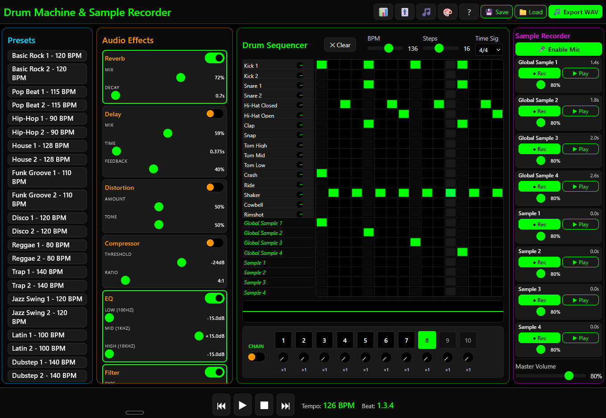

# Web Drum Machine & Sample Recorder

A browser-based music creation tool designed for children ages 8-12, featuring a professional drum sequencer, sample recorder, and audio effects - all with zero dependencies.



## Features

### Drum Machine
- **24-track sequencer** (16 drum sounds + 8 sample triggers)
- **Variable step grid** (4-48 steps) with time signatures (4/4, 3/4, 12/8)
- **100+ preset patterns** across 50+ genres (Rock, Hip-Hop, House, Jazz, and more)
- **10 pattern slots** with chain mode for song arrangement
- **Play/Pause with resume** - pause and continue from where you left off

### Sample Recorder
- **8 sample tracks** (4 global + 4 pattern-specific)
- **Microphone recording** with auto gap removal
- **Start trim slider** (0-5s) for trimming sample intros
- **Trigger samples from the sequencer grid**
- Samples saved in compressed WebM format

### Audio Effects
8 real-time effects with adjustable parameters:
- Reverb, Delay, Distortion, Compressor
- 3-Band EQ, Filter (LP/HP/BP), Chorus, Phaser

### Additional Features
- **3 visual themes**: Dark, Matrix (green), Vivid (colorful)
- **Real-time waveform visualization**
- **Session save/load** with full state persistence
- **WAV export** for sharing your creations
- **Keyboard shortcuts** for quick access
- **Fully responsive** - works on desktop and tablets

## Quick Start

1. Open `index.html` in a modern web browser
2. Click a preset pattern or create your own beat
3. Press **Play** (or Space) to hear your creation
4. Enable the microphone to record samples
5. Save your session to continue later

**No installation required** - just open and play!

## Technology

- **Vanilla JavaScript** (ES6+) - no frameworks, no build process
- **Web Audio API** - professional-grade audio with sample-accurate timing
- **HTML5 Canvas** - smooth 60fps visualizations
- **CSS Grid/Flexbox** - responsive full-screen layout
- **MediaRecorder API** - native browser recording

## Browser Support

| Browser | Version |
|---------|---------|
| Chrome  | 90+     |
| Firefox | 88+     |
| Safari  | 14+     |
| Edge    | 90+     |

## Project Structure

```
js/
├── main.js           # Application entry point
├── audio-engine.js   # Web Audio API management
├── sequencer.js      # Drum machine and scheduling
├── loop-pedal.js     # Sample recording and playback
├── effects.js        # Audio effects chain
├── song-mode.js      # Pattern bank and chain mode
├── ui.js             # UI rendering and events
├── storage.js        # Session persistence
├── presets.js        # 100+ drum patterns
├── visualizations.js # Waveform displays
└── wav-encoder.js    # WAV export encoding
```

## Keyboard Shortcuts

| Key | Action |
|-----|--------|
| `Space` | Play/Pause |
| `Esc` | Stop |
| `+/-` | Adjust tempo |
| `1-9` | Load preset patterns |
| `T` | Cycle themes |
| `S` | Save session |
| `H` | Toggle help |

## Development

No build tools required! Simply:

```bash
# Clone the repository
git clone https://github.com/yourusername/web_drum_machine_and_loop_pedal.git

# Open in browser
open index.html
```

For development details, see [CLAUDE.md](CLAUDE.md).

## License

MIT License - Feel free to use, modify, and share for educational purposes.

---

Made with care for young musicians everywhere.
